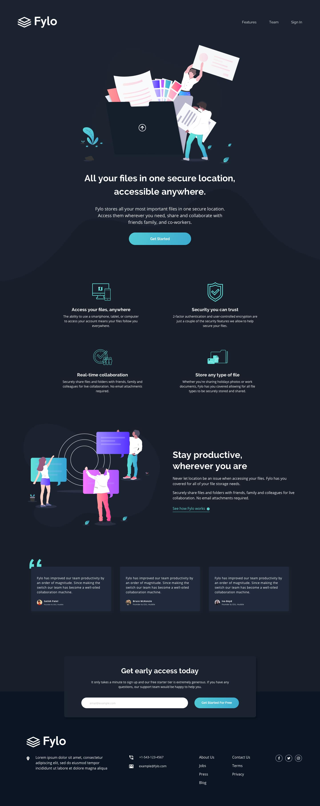
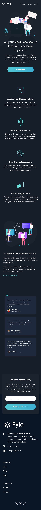

# 🌑 Fylo Dark Theme Landing Page

Projeto desenvolvido a partir de um desafio do [Frontend Mentor](https://www.frontendmentor.io?utm_source=chatgpt.com) com foco em praticar **HTML semântico**, **CSS responsivo**, **Bootstrap** e **JavaScript**, construindo uma landing page moderna com tema escuro.

---

<div align="center">

# 🚀 Fylo Landing Page

Landing page responsiva para armazenamento e compartilhamento de arquivos na nuvem.

<br>


</div>

---

## 🔗 Links

<div align="center">

|                                            🌐 Live Site                                            |                                           📂 Repositório                                          |                                                                     🎯 Desafio                                                                     |
| :------------------------------------------------------------------------------------------------: | :-----------------------------------------------------------------------------------------------: | :------------------------------------------------------------------------------------------------------------------------------------------------: |
| [Ver Projeto Online](https://anaclarissi.github.io/fylo-dark-landing-page/?utm_source=chatgpt.com) | [GitHub Repository](https://github.com/anaClarissi/fylo-dark-landing-page?utm_source=chatgpt.com) | [Frontend Mentor Challenge](https://www.frontendmentor.io/challenges/fylo-dark-theme-landing-page-5ca5f2d21e82137ec91a50fd?utm_source=chatgpt.com) |

</div>

---

## 👩‍💻 Perfis

* [Meu GitHub](https://github.com/anaClarissi?utm_source=chatgpt.com)
* [Frontend Mentor Profile](https://www.frontendmentor.io/profile/anaClarissi?utm_source=chatgpt.com)

---

# 🛠️ Tecnologias Utilizadas

<div align="center">


</div>

---

# ✨ Funcionalidades

✔️ Layout totalmente responsivo

✔️ Landing page moderna em dark theme

✔️ Grid de recursos e funcionalidades

✔️ Seção de depoimentos

✔️ Formulário com validação de e-mail

✔️ Hover effects e transições suaves

✔️ Navegação responsiva

✔️ Footer completo com redes sociais


---

# 📂 Estrutura do Projeto

```bash
fylo-dark-landing-page/
│
├── index.html
│
├── src/
│   ├── css/
│   │   └── style.css
│   │
│   ├── js/
│   │   └── index.js
│   │
│   └── images/
│
└── design/
```

---

# 📸 Preview do Projeto

<div align="center">

## 💻 Desktop



<br><br>

## 📱 Mobile



</div>

---

# 🎯 O que foi praticado

* HTML5 semântico
* Flexbox e CSS Grid
* Responsividade
* Bootstrap
* JavaScript DOM
* Validação de formulários
* Organização de layout complexo
* Dark UI Design
* Media Queries
* Estruturação de landing pages

---

# 📚 Aprendizados

Esse projeto ajudou a reforçar conhecimentos em:

* Estruturação de páginas modernas
* Criação de layouts escaláveis
* Responsividade para múltiplos dispositivos
* Manipulação de elementos com JavaScript
* Organização visual de componentes
* UX/UI em landing pages

---

# 🔮 Melhorias Futuras

* Adicionar animações mais avançadas
* Implementar menu mobile funcional
* Melhorar acessibilidade
* Adicionar integração real ao formulário
* Criar transições mais interativas

---

<div align="center">

# 👩‍💻 Desenvolvido por Ana Clarissi

💙 Obrigada por visitar este projeto!

<br>

[GitHub - Ana Clarissi](https://github.com/anaClarissi?utm_source=chatgpt.com)

[Frontend Mentor - anaClarissi](https://www.frontendmentor.io/profile/anaClarissi?utm_source=chatgpt.com)

</div>
